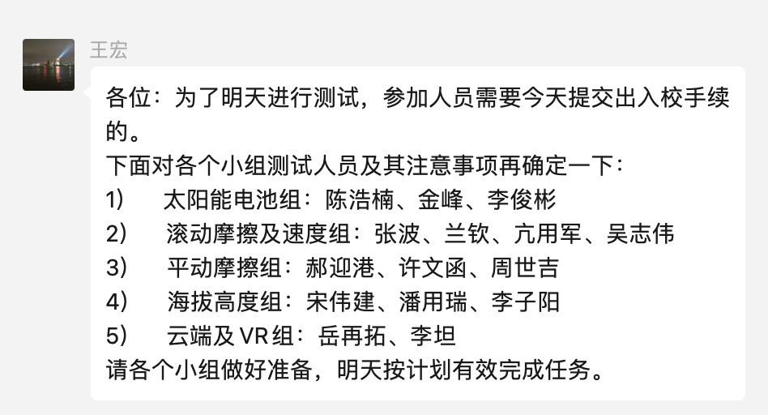

title:: 2021.12.5 -> 2021.12.11每周复盘

-
- 昨天干活，累得手都抬不起来，今天一天都很不舒服，学习也学不下去，结果今天一看群里去测试的名单也没有我，保温箱外壳也没让我做，这是想把我从专利里踢出去啊，我承认我确实做的不多，但这也并不说明别人就做的多么好，看来王宏真就一点不把我放在眼里，这样也好，我就做个透明人，平淡毕业，多余的话不说，多余的事不做，想让我给她劳心劳力，真不可能了；
- 
- ~~开发板的外壳 CHN 就别想了，我是不会做了，谁想要谁就自己做；~~
	- 如果有专利，还是得做，先糊弄一个再说
- 之前就有预感，我的研究生逐渐走到高中时的状态了，不同之处在于导师也就是领导，对我的影响变大了，以前我可以无视一切，现在不行，因为还要想一想将来，需要“自谋出路”；
- 但也不是没有共性：无非都是三年而已，这里不能困住我，人的思想是自由的；
- 这么想一下，说不定到工作时就又会变好了，人生总是好一阵，坏一阵；
- 另外要珍惜人前人，不要再沉浸在过去的幻想里面了，十鸟在林不如一鸟在手，看得见摸得着的才是真实，自作多情现在连自己都感动不了了，就别内耗了。 2021.12.6
-
  ---
- 我的笔记系统真的需要按马大伟这么来吗？
- 我目前的需求是：
	-
	  1. 每周复盘
	-
	  2. 浮墨笔记
	-
	  3. 学习记录